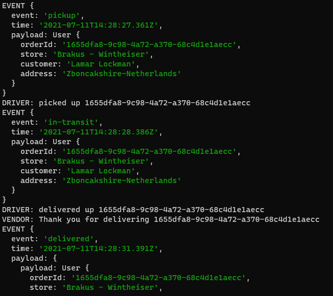
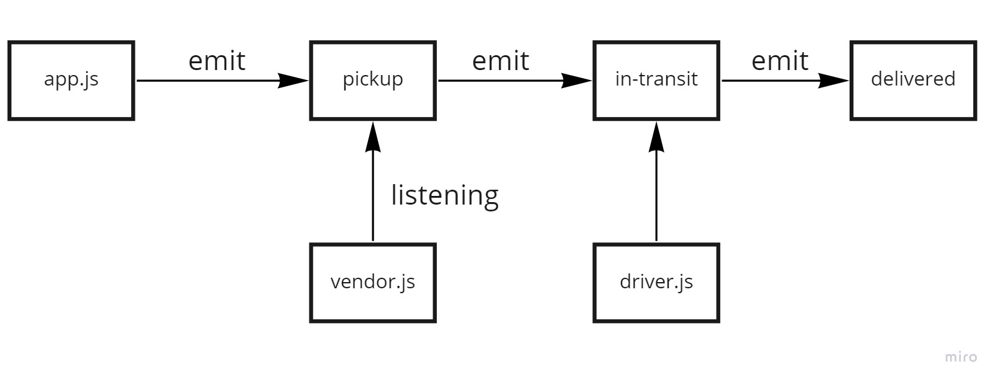

# caps

### Author : Hatem Husnieh  

## install  
1. copy the link of the repo
1. clone the repo on your local machine by `git clone repo-url`
1. download independencies by `npm i`
1. run the app

## Deploy, Run and Test
- [test report](https://github.com/Hatemhusnieh/caps/actions)
- [deployed link]()
- [Pull Request](https://github.com/Hatemhusnieh/caps/pull/1)

### Setup  

#### Running the app  
- either:
  1. `npm start`
  1. `nodemon`
- log:
  - returns
    

#### Test   
- Unit test: `npm run test`
- Lint test: `npm run lint`

### UML:  
